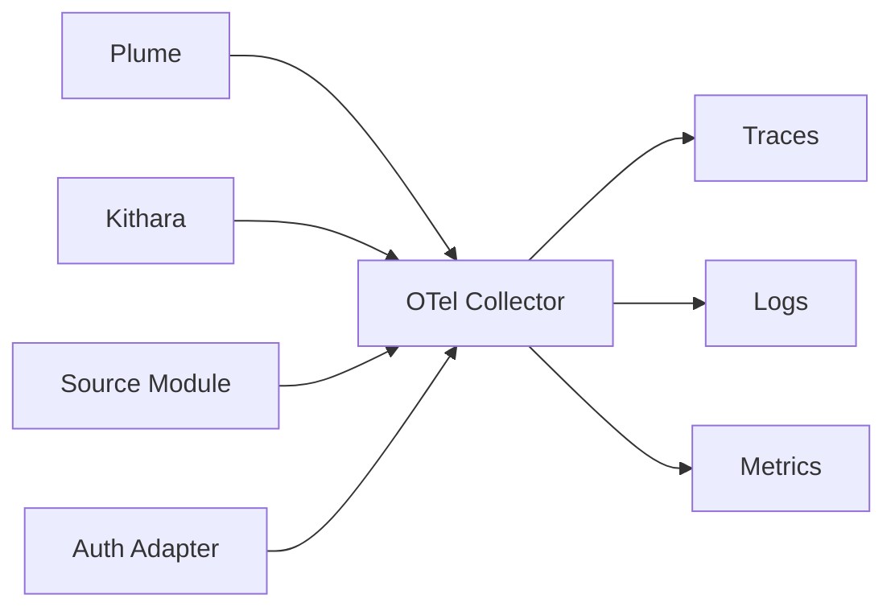

# Observability

**Principle: everything is under coverage.** ([ADR 008](../adrs/008-otel-observability.md))

## Mandatory telemetry

| Component | service.name example |
|-----------|---------------------|
| Kithara | `bardie.kithara` |
| Plume | `bardie.plume` |
| YouTube module | `bardie.source.youtube` |
| auth-local | `bardie.auth.local` |

## Module contract

Every module must:

1. Export OTLP (traces, metrics, logs)
2. Accept + forward W3C `traceparent` on inbound calls
3. Inject trace context on outbound calls

## Span attributes

- `struna.id`, `struna.slug`, `playback.access`, `control.access`
- `source.instance.id`, `auth.adapter.id`
- **Never** log tokens or passwords

## Trace scenarios

1. Login: Plume → Kithara → auth-local `Authenticate` → `ValidateToken`
2. Play: Plume → API → source `CreateInstance` → Neck → Stream Server
3. Legacy listen: Player → `/stream/{slug}` (root span with slug attribute)

## Reference stack

Grafana Tempo + Loki + Prometheus via OTel Collector. Backends swappable — OTLP is normative.

**Read next:** [../mvp/v0.1-scope.md](../mvp/v0.1-scope.md)
