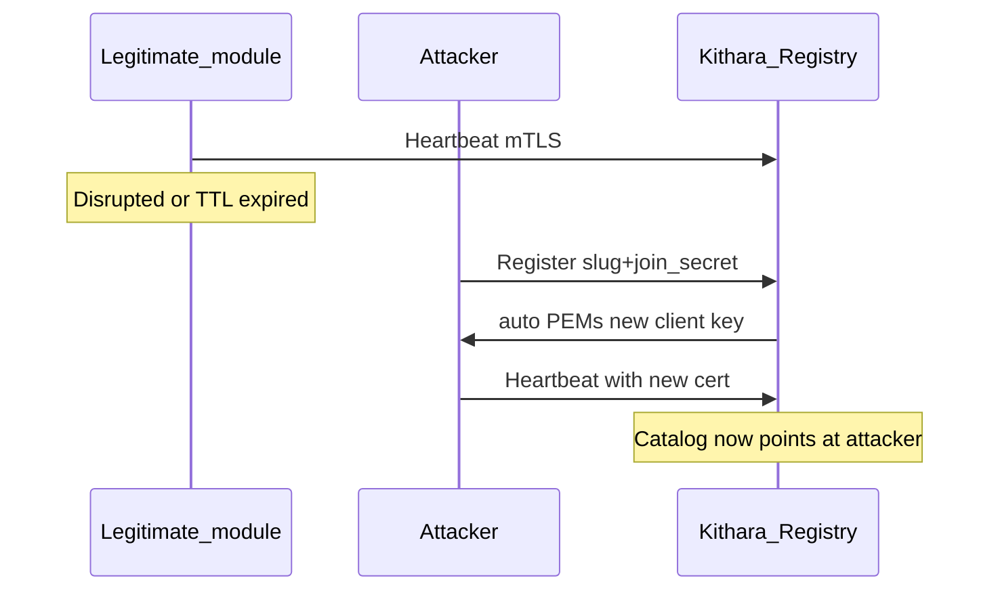

# Security audit — Module mesh mTLS (Phase 1)

Living audit of Module Registry + `Bardie.ModuleChannel` trust assumptions. Not a full product pen-test — focused on **who can become a trusted module**.

**Status:** Phase 1 skeleton (in-memory registry, auto + preshared bootstrap). Revisit when registry state or cert pinning lands.

## Trust model (current)

| Stage | What authenticates | What does not |
|-------|--------------------|---------------|
| `Register` | Join secret for that **slug** (`BARDIE_JOIN_SECRETS`) | Prior client cert (unless caller happens to present one) |
| Steady state (`Heartbeat`, later work RPCs) | mTLS client cert signed by host CA, CN = slug | Join secret |
| Host CA / server TLS | Files under `BARDIE_GRPC_TLS_DATA_PATH` | Ephemeral in-memory-only CA when the path is empty |

**Auto** bootstrap may return `client_private_key_pem` on `RegisterResponse` — intended for **private mesh / trusted LAN only**. Prefer **preshared** when gRPC may cross untrusted networks ([grpc-module-registry](../interfaces/grpc-module-registry.md)).

## What persists across Kithara restart

| Material | Durable? | Notes |
|----------|----------|--------|
| Host CA + gRPC server cert | **Yes**, if `TlsDataPath` is on a volume | Generate-once; load on later boots |
| Module client certs (auto) | **No** on the host | Re-issued on every successful `Register`; module must store PEMs |
| Module client certs (preshared) | Operator-placed files | Not emitted on the wire |
| Registry + orch catalogs | **No** | In-memory; heartbeat TTL; empty after restart |

If `TlsDataPath` is ephemeral, the CA regenerates every cold start. Old module client certs stop validating; every module must `Register` again (and auto ships new private keys on the wire).

## Finding: slug takeover via join secret (auto)

**ID:** `MESH-REG-001`  
**Severity:** High when join secrets leak or the mesh is reachable beyond a private overlay; expected residual risk for auto on a closed Compose network  
**Component:** Module Registry `Register` + ModuleChannel `auto` issuer

### Vector

An attacker who knows the join secret for slug `S` can replace the legitimate module for `S`:

1. Wait for a **Register window** — cold start, Kithara restart (empty registry), or disrupt the real module until heartbeat TTL expires and the janitor drops `S`.
2. Call `Register` with slug `S` and the correct join secret (and any advertise address / capabilities they choose).
3. In **auto**, Kithara issues a **new** client cert + private key on the response and upserts catalogs.
4. Subsequent Heartbeats / dials treat the attacker as module `S`.

No race against the honest module’s cert is required: Phase 1 does **not** require presenting the previously issued client cert to re-Register, and does **not** pin “only serial N may speak as `S`.”

### Prerequisites

- Reachability to Kithara module gRPC (`:5000`).
- Knowledge of `BARDIE_JOIN_SECRETS[S]` (or ability to read Compose/secret store).
- Auto mode (or any mode that accepts Register with only the join secret as bootstrap).

Without the join secret, this inject fails at `Register`.

### Why this exists (design, not accidental)

Join secret is the **bootstrap** credential before mTLS exists. Auto deliberately trades “operator pre-places certs” for “first handshake pairs on a private network.” That implies: **whoever holds the join secret can pair** whenever the registry will accept `Register` for that slug.

### Mitigations (ops, today)

| Control | Effect |
|---------|--------|
| Keep `:5000` on an internal overlay only | Shrinks who can attempt Register |
| Treat join secrets as root credentials; rotate on suspicion | Shrinks who can succeed |
| Durable `BARDIE_GRPC_TLS_DATA_PATH` volume | Stable CA; avoids re-keying the whole mesh every Kithara restart |
| Prefer `BARDIE_MODULE_MTLS_BOOTSTRAP=preshared` off private mesh | No private keys on Register; operator-placed identity |

### Mitigations (product, planned / not Phase 1)

- Refuse auto re-Register for a live slug unless the caller presents the current client cert (or an admin break-glass).
- Persist or pin issued client cert thumbprints / serials per slug; revoke on replace.
- Optional durable registry so restart alone does not reopen every slug’s Register window.

## Related residual risks

| ID | Summary | Notes |
|----|---------|--------|
| `MESH-REG-002` | Auto private-key-on-wire | Any observer on the Register path in auto mode sees module client private keys. Private mesh assumption. |
| `MESH-REG-003` | Cert CN = slug, not instance | Interceptor validates CA + CN slug; does not bind to a single issuance after upsert. Same root cause as `MESH-REG-001` for takeover quality. |
| `MESH-REG-004` | Ephemeral TLS data dir | Every Kithara restart = new CA + forced re-Register storm + repeated auto key delivery. |

## Audit checklist (operators)

- [ ] Module gRPC not published on a public interface
- [ ] Join secrets unique per slug, not reused across environments
- [ ] `TlsDataPath` mounted on durable storage in any long-lived deploy
- [ ] Bootstrap mode = `preshared` whenever the channel leaves a trusted private network
- [ ] Document who can read Compose/secret store (same trust as join secrets)

## Related

- [grpc-module-registry](../interfaces/grpc-module-registry.md) — dial rules + auto vs preshared
- [configuration](configuration.md) — `BARDIE_JOIN_SECRETS`, TLS env knobs
- [deployment](deployment.md) — ports and networking
- Org modules-beyond-Bardie — orchestrators/library-shaped mesh ([org 07](https://github.com/Bardie-radio/.github/blob/main/profile/docs/architecture/07-modules-beyond-bardie.md))

**Read next:** [configuration.md](configuration.md)
