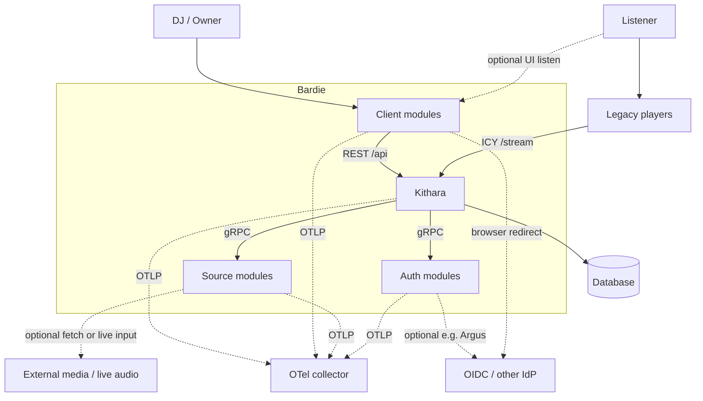

# System Context (C4 Level 1)

Kithara-side view of who talks to Bardie. Whole-ecosystem journeys and repo map live in the [org ecosystem context](https://github.com/Bardie-radio/.github/blob/main/profile/docs/architecture/02-ecosystem-context.md).

<!-- mermaid-source: docs/architecture/diagrams/system-context.mmd -->

**Kithara** is the core: Struna lifecycle, module orchestration, user DB ownership, JWT verification (no built-in login), and ICY output via Stream Server. **Bardie modules** (client, source, auth) are separate deployables that register with Kithara.

| Actor / system | Role |
|----------------|------|
| **DJ / Owner** | Controls Strunas through a **client module** (user-aware JWT or static managed-user credentials) |
| **Listener** | Tunes in via **legacy players** or optionally a UI client |
| **Client modules** | Plume, Beak, Cauda, … — REST to Kithara; never call auth/source modules directly |
| **Source modules** | Magpie, Starling, Catbird, … — gRPC + PCM into Kithara’s session FIFO |
| **Auth modules** | Bes, Argus, Hecate, … — issue/forward JWTs; Kithara verifies |
| **Database** | Persistence for users, bindings, Strunas, library (SQLite or Postgres) |
| **OIDC / other IdP** | External only when an auth module needs it (Argus); Bes stays self-contained |
| **External media** | Optional hop for fetch (Magpie) or live input (Starling) |
| **OTel collector** | External; every Bardie process exports OTLP |
| **Legacy players** | Listen-only ICY clients (VLC, VRChat, …) |

**Related:** [glossary](../glossary.md) · [03-runtime-data-flow](03-runtime-data-flow.md) · [org architecture hub](https://github.com/Bardie-radio/.github/tree/main/profile/docs/architecture)

**Read next:** [02-internal-structure.md](02-internal-structure.md)
