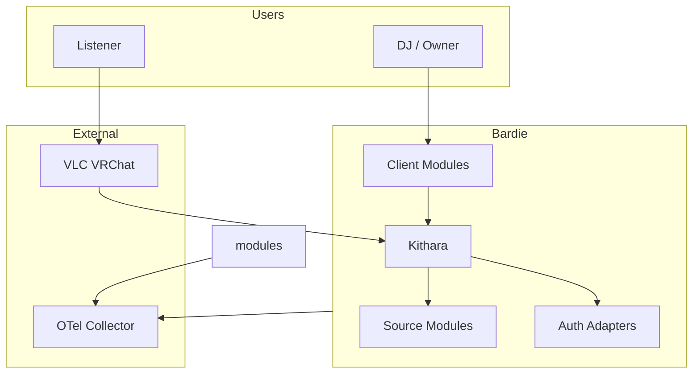

# System Context (C4 Level 1)

Bardie is a **self-hosted modular audio broadcast platform**. Users create **Strunas** (streams), queue music via source modules, and interact through **client modules** (Plume, Discord bot, Telegram bot, …) or listen via legacy players.

**Org overview:** [Bardie-radio/.github/docs/architecture](https://github.com/Bardie-radio/.github/tree/main/docs/architecture)

**Read next:** [02-container-diagram.md](02-container-diagram.md)
