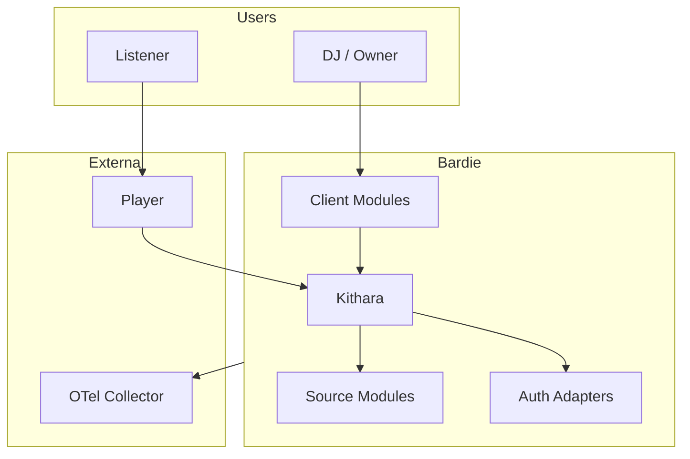

# System Context (C4 Level 1)

<!-- mermaid-source: diagrams/system-context.mmd -->

**Kithara** is the core of Bardie: Struna (stream) lifecycle, module orchestration, and ICY audio output. DJs create and control Strunas through **client modules**; listeners can also tune in with ordinary players.

This page is the Kithara-side view. Whole-ecosystem actors and journeys live in the [org ecosystem context](https://github.com/Bardie-radio/.github/blob/main/profile/docs/architecture/02-ecosystem-context.md).

**Related:** [glossary](../glossary.md) · [org architecture hub](https://github.com/Bardie-radio/.github/tree/main/profile/docs/architecture)

**Read next:** [02-internal-structure.md](02-internal-structure.md)
