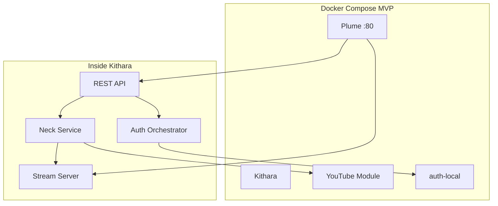

# Container Diagram (C4 Level 2)

## Containers (MVP authenticated = 4)

| Container | Repo |
|-----------|------|
| kithara | bardie-kithara |
| plume | bardie-plume |
| youtube-module | TBD |
| auth-local | bardie-auth-local |

Streaming runs **inside kithara** — no Icecast container.

**Read next:** [03-runtime-data-flow.md](03-runtime-data-flow.md)
