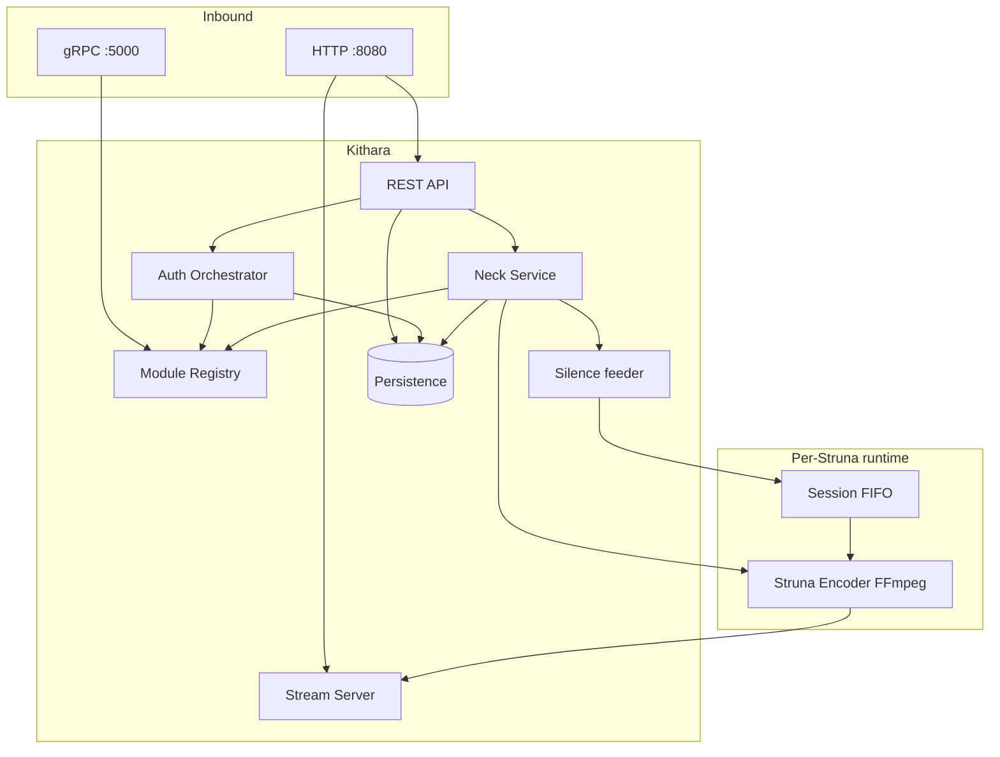

# Internal Structure

<!-- mermaid-source: docs/architecture/diagrams/internal-structure.mmd -->


How **Kithara** is structured inside one process. Ecosystem layout (Plume, modules, edge) lives in the [org component landscape](https://github.com/Bardie-radio/.github/blob/main/profile/docs/architecture/03-component-landscape.md) and [system context](01-system-context.md).

## Building blocks

| Component | Responsibility |
|-----------|----------------|
| **REST API** | Client-facing control: Struna lifecycle, play/skip/queue, auth discovery/authenticate |
| **Stream Server** | `GET /stream/{slug}` — ICY-over-HTTP listener fan-out |
| **Auth Orchestrator** | Discovery, identity routing, user JWT verify (JWKS), guest-code exchange + guest JWT mint/verify, refresh proxy to modules, join secrets, listen checks |
| **Module Registry** | Source + auth + client module register / heartbeat (join secret) |
| **Neck Service** | Alive Struna lifecycle, session FIFOs, silence feeder, `StartTrack`/`StopTrack`, wire encoders to Stream Server |
| **Silence feeder** | Keeps FFmpeg fed when no module writer is attached |
| **Struna Encoder** | Per-alive-Struna FFmpeg; reads session FIFO for Struna life |
| **Persistence** | Users + bindings, Struna metadata, library/Tune refs (SQLite or Postgres) |

## Target solution layout (foreshadow)

Prefer **feature-first** folders and Minimal APIs ([aspnet team rules](../../../.cursor/rules/aspnet.mdc) in repo):

```text
Features/
  Streams/      # REST + handlers
  Auth/         # discovery, JWT, local provider
  Modules/      # registry gRPC clients
  Streaming/    # Stream Server, ICY
Infrastructure/
  Persistence/  # EF, IDbContextFactory
  Neck/         # hosted FFmpeg supervisor + FIFO + silence
```

FFmpeg child processes **outlive HTTP requests** — own them with a hosted background supervisor, not a request-scoped service alone.

## Control vs audio

| Plane | Inside Kithara | Outside |
|-------|----------------|---------|
| **Control** | API → Auth / Neck / Registry | gRPC to source & auth modules |
| **Audio** | Silence/FIFO → Encoder → Stream Server | Modules write PCM into FIFO path |

HTTP is for clients/listeners (API + streams). Module control never rides the public HTTP port — see [03-runtime-data-flow](03-runtime-data-flow.md).

## Boundaries (not inside this process)

| Outside | Talks to |
|---------|----------|
| Client modules (Plume, bots, …) | REST API |
| Legacy players | Stream Server |
| Source modules | Registry + FIFO write path |
| External auth adapters | Auth Orchestrator via Registry |
| Edge reverse proxy | HTTP port only (`/api`, `/stream`; OIDC callback on Kithara) |

Container ports, mounts, and edge wiring: [operations/deployment](../operations/deployment.md).

## Related ADRs

- [001 Broadcast sync](../adrs/001-broadcast-sync-model.md)
- [002 Native FFmpeg streaming](../adrs/002-kithara-native-ffmpeg-streaming.md)
- [003 gRPC control plane](../adrs/003-grpc-control-plane.md)
- [004 Session FIFO](../adrs/004-source-instance-socket-audio-plane.md)
- [007 Auth adapters](../adrs/007-auth-adapter-modules.md)

**Read next:** [03-runtime-data-flow.md](03-runtime-data-flow.md)
