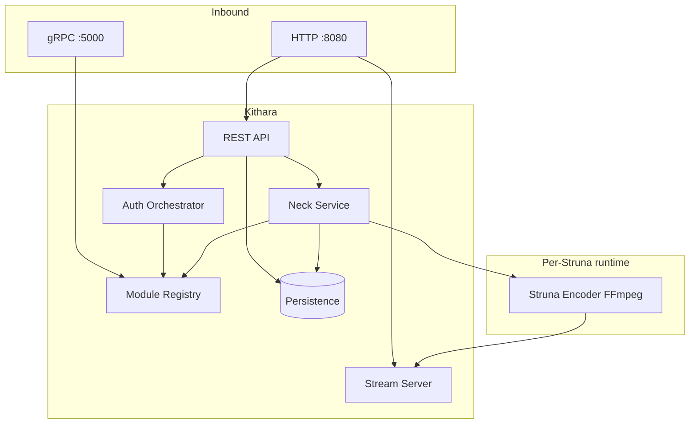

# Internal Structure

<!-- mermaid-source: diagrams/internal-structure.mmd -->

How **Kithara** is structured inside one process. Ecosystem layout (Plume, modules, edge) lives in the [org component landscape](https://github.com/Bardie-radio/.github/blob/main/profile/docs/architecture/03-component-landscape.md) and [system context](01-system-context.md).

## Building blocks

| Component | Responsibility |
|-----------|----------------|
| **REST API** | Client-facing control: Struna CRUD, play/skip/stop, now-playing, auth discovery |
| **Stream Server** | `GET /stream/{slug}` — ICY-over-HTTP listener fan-out |
| **Auth Orchestrator** | Aggregates adapter discovery; validates user/service tokens for API and protected streams |
| **Module Registry** | Tracks connected source modules and auth adapters (gRPC register / heartbeat) |
| **Neck Service** | Struna lifecycle: spawn/teardown encoders, bind source instances, wire audio into Stream Server |
| **Struna Encoder** | Per-active-Struna FFmpeg process; reads a source-instance socket, writes encoded audio to Stream Server |
| **Persistence** | Struna metadata, library/Tune refs, config (SQLite or Postgres) |

## Control vs audio

| Plane | Inside Kithara | Outside (same host / network) |
|-------|----------------|-------------------------------|
| **Control** | API → Auth Orchestrator / Neck / Registry | gRPC to source & auth modules |
| **Audio** | Encoder → Stream Server | Unix socket from source instance → Encoder |

HTTP is only for clients/listeners (API + streams). Module control never rides the public HTTP port — see [03-runtime-data-flow](03-runtime-data-flow.md).

## Boundaries (not inside this process)

| Outside | Talks to |
|---------|----------|
| Client modules (Plume, bots, …) | REST API |
| Legacy players | Stream Server |
| Source modules | Module Registry + source-instance sockets |
| Auth adapters | Auth Orchestrator via Registry |
| Edge reverse proxy | HTTP port only (`/api`, `/stream`) |

Container ports, mounts, and edge wiring: [operations/deployment](../operations/deployment.md).

## Related ADRs

- [001 Broadcast sync](../adrs/001-broadcast-sync-model.md)
- [002 Native FFmpeg streaming](../adrs/002-kithara-native-ffmpeg-streaming.md)
- [003 gRPC control plane](../adrs/003-grpc-control-plane.md)
- [007 Auth adapters](../adrs/007-auth-adapter-modules.md)

**Read next:** [03-runtime-data-flow.md](03-runtime-data-flow.md)
