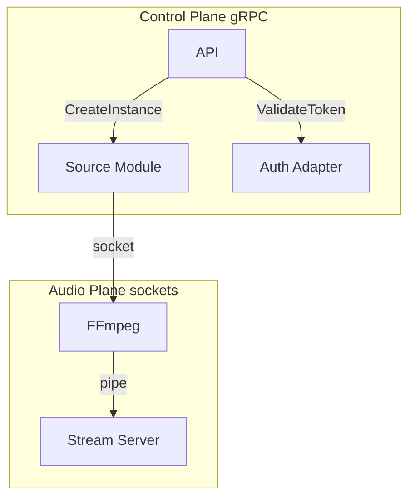

# Runtime Data Flow

<!-- mermaid-source: diagrams/runtime-data-flow.mmd -->

Two planes stay separate:

| Plane | Transport | Data |
|-------|-----------|------|
| **Control** | gRPC | Commands, auth, status |
| **Audio** | Unix socket → pipe | Raw / encoded audio |

HTTP is for Plume ↔ Kithara API and listeners ↔ Stream Server only.

**Related:** [ADR 003](../adrs/003-grpc-control-plane.md) · [ADR 004](../adrs/004-source-instance-socket-audio-plane.md)

**Read next:** [../domains/source-instances.md](../domains/source-instances.md)
