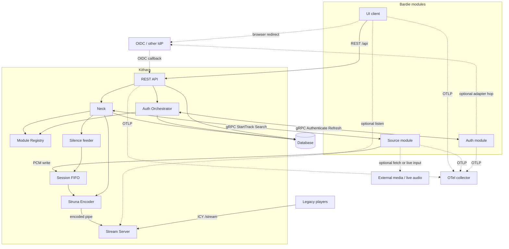

# Runtime Data Flow

How control, auth, audio, and telemetry move at runtime.

<!-- mermaid-source: docs/architecture/diagrams/runtime-data-flow.mmd -->

## Planes

| Plane | Path | Data |
|-------|------|------|
| **Control** | UI → REST API → Neck / Auth Orchestrator → Module Registry → module gRPC | Play, queue, discovery, authenticate, refresh |
| **Persistence** | API / Auth Orchestrator / Neck → Database | Users, bindings, Struna metadata, library refs |
| **Audio** | Source → session FIFO → Encoder → **Stream Server** → listeners | Canonical PCM in; ICY / encoded audio out |
| **Telemetry** | Every box → OTel collector | Traces, metrics, logs (OTLP) |

## Module shapes (same sockets, different guts)

Modules share one registration / gRPC surface with Kithara. What they do *outside* that socket varies:

| Shape | Auth example | Source example | External hop? |
|-------|--------------|----------------|---------------|
| **Self-contained** | Bes mints JWT in-module | Catbird reads local / uploaded files | No |
| **Fetch + process** | — | Magpie pulls via ytdl, decodes, writes PCM | Yes — media hosts |
| **Adapter / pass-through** | Argus forwards IdP JWTs and refreshes through the IdP | Starling re-broadcasts a continuous external input | Yes — IdP or live audio |

Dashed edges on the diagram are those optional external hops. Solid edges are the always-on Bardie paths (REST, gRPC, FIFO, ICY, OTLP).

UI clients stay on REST for control; they never call auth or source modules directly. Auth adapters stay behind Kithara (BFF). The IdP is the other public party only for redirect-style login.

**Related:** [02-internal-structure](02-internal-structure.md) · [ADR 003](../adrs/003-grpc-control-plane.md) · [ADR 004](../adrs/004-source-instance-socket-audio-plane.md) · [ADR 007](../adrs/007-auth-adapter-modules.md)

**Read next:** [../domains/source-instances.md](../domains/source-instances.md)
