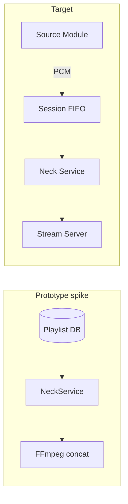

# Prototype Spike: Neck.cs + FFmpeg

The former root `Services/Neck.cs` spike has been removed from the tree (Phase 1 reshape). This page records what that spike proved and what to discard.

## What the spike proved

- FFmpeg orchestration from .NET is viable
- Process lifecycle tracking (`ConcurrentDictionary<Guid, Process>`) works
- ICY metadata intent is correct (implementation was wrong — stdin approach invalid)

## What to discard

| Spike behavior | Target replacement |
|----------------|-------------------|
| Singleton `NeckService` + scoped `DbContext` | Hosted FFmpeg supervisor + `IDbContextFactory` |
| Playlist → FFmpeg `concat:` shuffle | Module track jobs → session FIFO → per-Struna encoder |
| No HTTP API wiring | `POST /api/streams/{id}/play` etc. |
| Output URL as FFmpeg arg (Icecast-style) | Pipe → Kithara Stream Server |
| ICY via `process.StandardInput` | Stream Server `icy-metaint` injection |
| `StartStreamAsync(playlistId, stream)` | `StartTrack` via source module |

## What to keep

- **Neck** name and role — stream lifecycle manager inside Kithara
- FFmpeg as encoding engine ([ADR 002](../adrs/002-kithara-native-ffmpeg-streaming.md))
- Active stream tracking concept (maps to alive Struna state)

## Prototype model gaps

- [Struna.cs](../../Models/Struna.cs) — no slug, access modes, or source binding
- [Tune.cs](../../Models/Tune.cs) — `PlaylistId` + `Playlists` conflict

**Related:** [ADR 002](../adrs/002-kithara-native-ffmpeg-streaming.md) · [ADR 004](../adrs/004-source-instance-socket-audio-plane.md) · [domains/streams.md](../domains/streams.md) · [glossary](../glossary.md)

**Read next:** [../README.md](../README.md)
